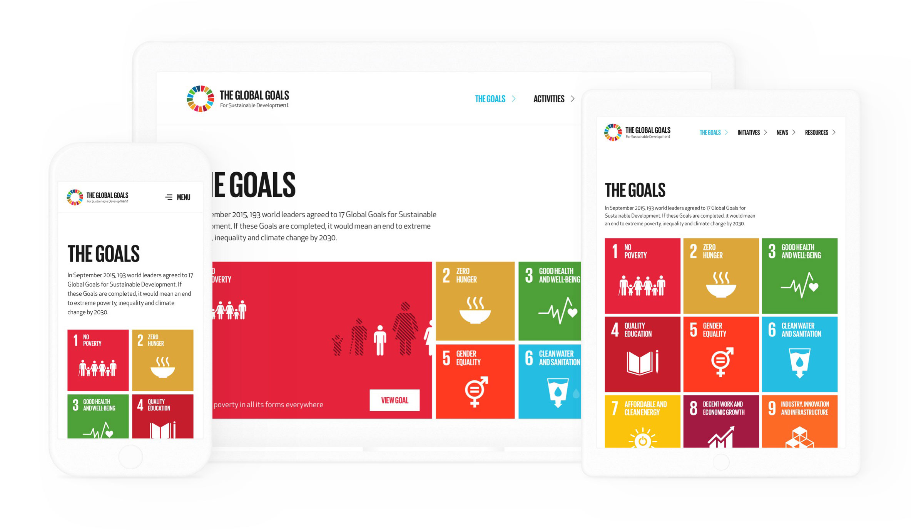

<div align="center">

# The Global Goals

[](http://www.globalgoals.org) [](https://github.com/codeandconspire/globalgoals.org/releases) [](https://standardjs.com)



Website for The United Nations Global Goals for Sustainable Development
[www.globalgoals.org](https://www.globalgoals.org)

</div>

## Setup

The application requires [Node.js](https://nodejs.org) version 7 or later. Start with installing all dependencies by running the following command:

```bash
$ npm install
```

### Environment variables

The application (both server and front end) depend on a set of environment variables. Define them in a .env file in the project root. The following command will generate a template for you which you to populate with secret keys and whatnot:

```bash
$ npm run setup
```

### Start the server

During development use the `restart` script which loads the variables in the `.env` file, before starting the server. The server watches for file changes and restarts when needed.

```bash
$ npm restart
```

## Technologies

The stack consists of a Node server running [Koa](http://koajs.com) and a front end built with [Choo](https://github.com/choojs/choo). Content is being fetched from the headless CMS [Prismic.io](https://prismic.io).

Routing to and rendering views are all handled by Choo, the server only fetches content and caches the response.

### Koa

Koa is a small framework for node which uses the new [`async/await`](https://developer.mozilla.org/en-US/docs/Web/JavaScript/Reference/Statements/async_function) syntax of ES2017. Just like most other popular web frameworks, Koa relies on middleware that intercepts and handles requests before (optionally) falling through to the next middleware. With [`Promises`](https://developer.mozilla.org/en/docs/Web/JavaScript/Reference/Global_Objects/Promise) and the new `async/await` syntax this makes for building very lean and expressive applications.

### Choo

Choo is a front-end framework for authoring websites and apps using standard JavaScript syntax and APIs. Templates are defined in JavaScript files as [template literals](https://developer.mozilla.org/en-US/docs/Web/JavaScript/Reference/Template_literals) and transformed to actual DOM nodes. The generated tree is then compared with and morphed into the real DOM tree updating where needed, much like React, just without the virtual DOM-part.

*Note: Choo is currently exploring ways to incorporate components at the framework level. A preview of the proposed solution is implemented in this application.*

### SUIT CSS

The CSS is written and organized following the [SUIT CSS](https://suitcss.github.io/) principles. The source is then processed with a few [postcss](https://github.com/postcss/postcss) plugins.

## Build and deploy

When building the application, take care to update the version field in [package.json](package.json). The version number is used for breaking cache and ensuring that clients are receiving up to date assets. Npm has a `version` command that does just this, commits it and generates a git tag.

```bash
$ npm version 2.1.0
```

To build and minify the client application and styles run the build command. The build script will try and load the local `.env` file so make sure to define (overwriting) the appropriate variables before executing the script.

```bash
$ NODE_ENV=production npm run build
```

The application is built for running on [Now](https://zeit.co/now) but is in no way required to. Any server with node installed should be able to build and host the application.

## License

[Creative Commons Attribution 3.0 Unported (CC-BY)](https://tldrlegal.com/license/creative-commons-attribution-(cc))
